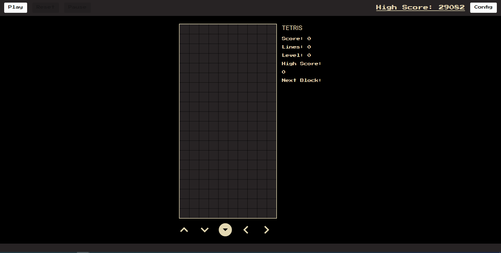

# ng-tetris

Tetris game in Angular. [Play it now!](http://tetris.lroedal.net/)

Forked from [melcor76/ng-tetris](https://github.com/melcor76/ng-tetris).

Added:

- Theme support
- Music
- Buttons for mobile support
- Supports touch (swipe in any direction will count as pressing the arrow key in that direction. Double clicking will 'drop' the current piece)
- High score and list which saves to local storage
- Settings saved in local storage

## Development server

Run `npm start` for a dev server. Navigate to `http://localhost:4200/`. The app will automatically reload if you change any of the source files.

## Build

Run `ng build` to build the project. The build artifacts will be stored in the `dist/` directory. Use the `--prod` flag for a production build.
